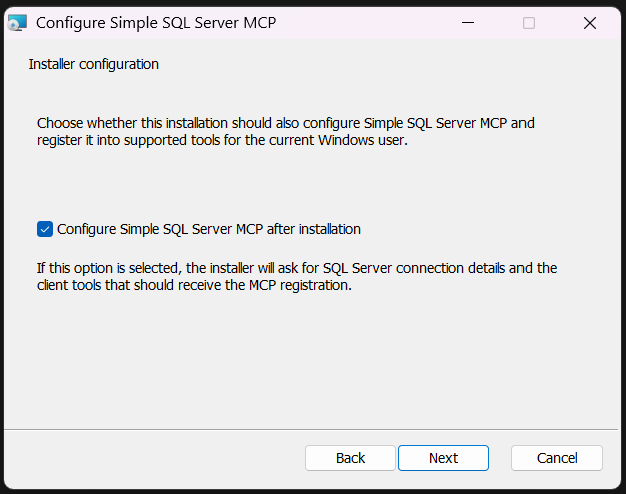
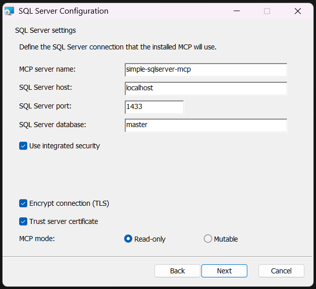
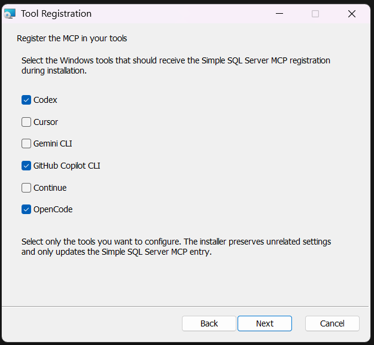

# Simple SQL Server MCP

Simple SQL Server MCP is a local MCP server for SQL Server developer workflows.

It gives an AI agent a controlled way to:

- inspect databases and schema
- sample data
- run complex read queries
- run explicit mutable SQL when enabled
- inspect and execute stored procedures

This project is designed for developer and test databases. It is not intended to be a production hardening layer or a SQL Server administration suite.

## Installation

The repository currently supports two installation paths:

- Windows via a WiX MSI
- Unix-like systems via a separate shell-installer flow

### Download (recommended)

[](https://github.com/olivierpetitjean/simple-sqlserver-mcp/releases/latest/download/SimpleSqlServerMcp.Setup.msi)

Download **[SimpleSqlServerMcp.Setup.msi](https://github.com/olivierpetitjean/simple-sqlserver-mcp/releases/latest/download/SimpleSqlServerMcp.Setup.msi)** and run it.

Versioned GitHub releases also publish the Linux runtime source archive consumed by `install.sh`.

### Windows installer

Windows installer support currently includes:

- install only
- install and configure now
- global MCP registration for:
  - `Codex`
  - `Cursor`
  - `Gemini CLI`
  - `GitHub Copilot CLI`
  - `Continue`
  - `OpenCode`

Claude is intentionally not registered by the Windows installer at this stage.

Installer walkthrough:

1. Configure whether the installer should register Simple SQL Server MCP after installation.



2. Enter the SQL Server connection settings and MCP execution mode.



On Windows, the installer can optionally store the SQL password in the current user's Windows Credential Manager instead of writing `SQLSERVER_PASSWORD` into generated MCP client configs.

3. Choose which supported tools should receive the MCP registration.



### Linux installer

For Linux, use the shell installer:

```bash
curl -fsSL https://raw.githubusercontent.com/olivierpetitjean/simple-sqlserver-mcp/master/install.sh | bash
```

The Linux installer:

- downloads a minimal runtime source archive
- builds a self-contained Linux binary locally on the target machine
- installs the application into `/opt/simple-sqlserver-mcp`
- creates a wrapper at `/usr/local/bin/simple-sqlserver-mcp`
- prints the executable path and the environment variables to configure


## What This Project Is For

Typical use cases:

- debug application data issues with an AI agent
- compare schema or data across databases on one SQL Server instance
- inspect tables, columns, foreign keys, and stored procedures
- run advanced read queries with joins, CTEs, window functions, and cross-database references
- let an AI agent perform explicit schema or data mutations in a dev database
- back up a local test database before risky changes

Typical non-goals:

- production safety guarantees
- SQL Server instance administration
- backup/restore orchestration for production environments
- replacing SSMS or Azure Data Studio

## Tool Overview

The current server exposes these MCP tools:

- `server_info`
- `list_databases`
- `list_tables`
- `describe_table`
- `search_columns`
- `get_table_sample`
- `execute_read_query`
- `execute_write_query`
- `execute_transaction`
- `list_stored_procedures`
- `describe_stored_procedure`
- `execute_stored_procedure`

## Execution Modes

### `read-only`

Default mode.

Use this when you want the agent to:

- inspect metadata
- read data
- execute complex `SELECT` queries
- inspect stored procedures

In this mode:

- `execute_read_query` is allowed
- `execute_write_query` is blocked
- `execute_stored_procedure` is blocked

### `mutable`

Explicit opt-in mode.

Use this when you want the agent to:

- modify data
- modify schema
- create/drop databases
- run backups
- bulk import data
- execute stored procedures

In this mode:

- `execute_write_query` is enabled
- `execute_transaction` is enabled
- `execute_stored_procedure` is enabled

## Supported SQL Surface

### Read-only execution

`execute_read_query` accepts:

- one `SELECT`
- `WITH ... SELECT`
- joins
- subqueries
- `UNION`
- aggregates
- window functions
- cross-database reads

Rejected in read-only mode:

- multiple statements
- `SELECT INTO`
- all mutable statements
- `EXEC`

### Mutable execution

`execute_write_query` currently supports:

- `SELECT INTO`
- `INSERT`
- `UPDATE`
- `DELETE`
- `MERGE`
- `CREATE DATABASE`
- `ALTER DATABASE`
- `DROP DATABASE`
- `BACKUP`
- `BULK INSERT`
- `CREATE TABLE`
- `ALTER TABLE`
- `DROP TABLE`
- `TRUNCATE TABLE`
- `CREATE/ALTER/DROP PROCEDURE`
- `CREATE OR ALTER PROCEDURE`
- `CREATE/ALTER/DROP FUNCTION`
- `CREATE OR ALTER FUNCTION`
- `CREATE/ALTER/DROP VIEW`
- `CREATE OR ALTER VIEW`
- `CREATE/ALTER/DROP INDEX`
- `CREATE/ALTER/DROP SCHEMA`
- `CREATE/ALTER/DROP SEQUENCE`
- `CREATE/DROP TYPE`
- `CREATE/DROP SYNONYM`
- `CREATE/ALTER/DROP TRIGGER`
- `CREATE OR ALTER TRIGGER`

Still excluded from `execute_write_query`:

- free-form `EXEC`
- arbitrary multi-statement scripts
- unsupported SQL Server statement families outside the whitelist

### Transactional execution

`execute_transaction` executes multiple mutable SQL statements atomically inside one SQL Server transaction.

Intended use:

- group related `INSERT` / `UPDATE` / `DELETE` statements
- mix DML with transaction-safe object-level DDL in one atomic unit
- let an agent attempt a multi-step change without leaving partial state behind

Behavior:

- validates each statement with the existing mutable whitelist
- rejects database-level or unsafe statements that are not supported inside the transaction tool
- commits only if every statement succeeds
- rolls back the full transaction if any statement fails
- accepts an optional `isolationLevel`

Important limitation:

- this is a single-call transaction model
- the MCP does not keep open transactions across multiple tool calls

Supported `isolationLevel` values:

- `read_committed`
- `read_uncommitted`
- `repeatable_read`
- `serializable`
- `snapshot`

If `isolationLevel` is omitted, the MCP uses the default SQL Server transaction behavior for the session.

### Stored procedures

Stored procedures are treated as a dedicated feature, not as a side effect of `execute_write_query`.

Supported tools:

- `list_stored_procedures`
- `describe_stored_procedure`
- `execute_stored_procedure`

`describe_stored_procedure` returns:

- schema and procedure name
- creation/modification timestamps
- definition text
- parameters
- first result-set metadata when SQL Server can infer it

`execute_stored_procedure` returns:

- result sets
- output parameters
- return value
- rows affected
- duration

## Configuration

Configuration is environment-variable based. The server builds its SQL Server connection string internally from structured settings.

Required core variables:

- `SQLSERVER_HOST`
- `SQLSERVER_DATABASE`
- either:
  - `SQLSERVER_INTEGRATED_SECURITY=true`
  - or `SQLSERVER_USERNAME` + `SQLSERVER_PASSWORD`

Important behavior variables:

- `MCP_SQLSERVER_MODE`
- `MCP_SQLSERVER_MAX_ROWS`
- `MCP_SQLSERVER_COMMAND_TIMEOUT`
- `MCP_SQLSERVER_EXCLUDE_SYSTEM_DATABASES`
- `MCP_SQLSERVER_ALLOWED_DATABASES`
- `MCP_SQLSERVER_UNSAFE_ALLOWED_PATTERNS`

`MCP_SQLSERVER_ALLOWED_DATABASES` supports:

- `*` to allow every database that is not otherwise excluded
- a comma-separated list such as `Developpe-2022,Reporting`

If the variable is omitted, the effective behavior is the same as `*`.

See:

- [Configuration](docs/configuration.md)

## `targetDatabase`

`execute_read_query`, `execute_write_query`, and `execute_stored_procedure` accept an optional `targetDatabase` parameter.

This is an execution-context database, not a global config setting.

Use it when SQL Server expects the command to run inside a specific database context, especially for DDL such as:

- `CREATE VIEW`
- `CREATE PROCEDURE`
- `CREATE FUNCTION`
- `CREATE TRIGGER`

If `targetDatabase` is omitted, execution uses the configured default database and explicit cross-database references continue to work.

## Unsafe Overrides

The server also supports an explicit escape hatch:

- `MCP_SQLSERVER_UNSAFE_ALLOWED_PATTERNS`

This variable contains semicolon-separated .NET regular expressions. If the raw SQL text matches one of these patterns, the statement is allowed before the built-in whitelist is applied.

Example:

```text
MCP_SQLSERVER_UNSAFE_ALLOWED_PATTERNS=^DBCC\s+CHECKIDENT\b;^RESTORE\s+VERIFYONLY\b
```

This exists for local developer/test databases where flexibility matters more than strict MCP-side guardrails.

It intentionally weakens the safety model. See:

- [Safety](docs/safety.md)

## Example MCP Registration

Example with SQL authentication:

```json
{
  "mcpServers": {
    "sqlserver": {
      "command": "simple-sqlserver-mcp",
      "env": {
        "SQLSERVER_HOST": "localhost",
        "SQLSERVER_PORT": "1433",
        "SQLSERVER_DATABASE": "master",
        "SQLSERVER_USERNAME": "sa",
        "SQLSERVER_PASSWORD": "YourStrong(!)Password",
        "SQLSERVER_ENCRYPT": "false",
        "SQLSERVER_TRUST_SERVER_CERTIFICATE": "true",
        "MCP_SQLSERVER_ALLOWED_DATABASES": "*",
        "MCP_SQLSERVER_MODE": "read-only",
        "MCP_SQLSERVER_MAX_ROWS": "100",
        "MCP_SQLSERVER_COMMAND_TIMEOUT": "15"
      }
    }
  }
}
```

Example with integrated security:

```json
{
  "mcpServers": {
    "sqlserver": {
      "command": "simple-sqlserver-mcp",
      "env": {
        "SQLSERVER_HOST": "localhost",
        "SQLSERVER_PORT": "1433",
        "SQLSERVER_DATABASE": "master",
        "SQLSERVER_INTEGRATED_SECURITY": "true",
        "SQLSERVER_ENCRYPT": "false",
        "SQLSERVER_TRUST_SERVER_CERTIFICATE": "true",
        "MCP_SQLSERVER_ALLOWED_DATABASES": "*",
        "MCP_SQLSERVER_MODE": "read-only"
      }
    }
  }
}
```

## Development

Restore, build, and test:

```powershell
dotnet restore
dotnet build SimpleSqlServerMcp.sln
dotnet test SimpleSqlServerMcp.sln
```

Run locally:

```powershell
$env:SQLSERVER_HOST="localhost"
$env:SQLSERVER_DATABASE="master"
$env:SQLSERVER_INTEGRATED_SECURITY="true"
$env:SQLSERVER_ENCRYPT="false"
$env:SQLSERVER_TRUST_SERVER_CERTIFICATE="true"
dotnet run --project .\src\SimpleSqlServerMcp
```

## Repository Layout

```text
src/
  SimpleSqlServerMcp/
  SimpleSqlServerMcp.WindowsInstaller/
installer/
  windows/
tests/
  SimpleSqlServerMcp.UnitTests/
  SimpleSqlServerMcp.IntegrationTests/
  SimpleSqlServerMcp.WindowsInstaller.Tests/
docs/
```

## Additional Documentation

- [Specification](docs/spec.md)
- [Configuration](docs/configuration.md)
- [Safety](docs/safety.md)
- [Testing](docs/testing.md)
- [Architecture](docs/architecture.md)
